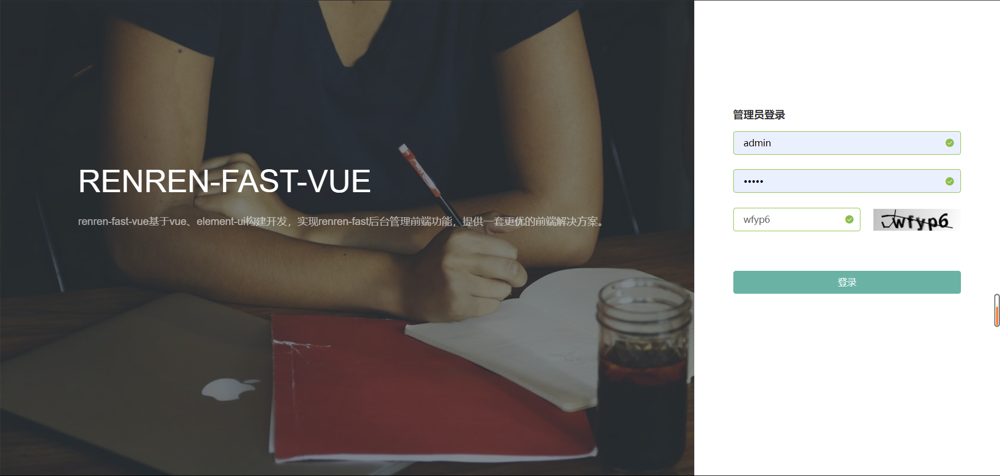
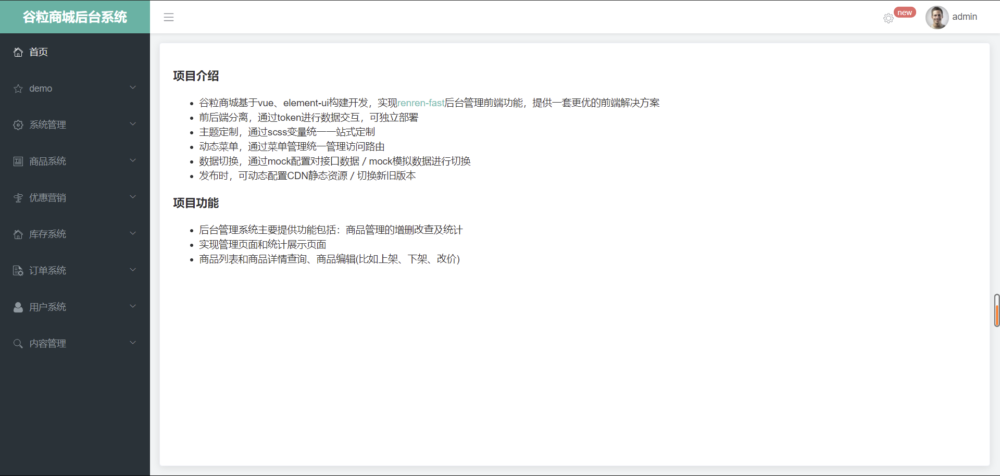
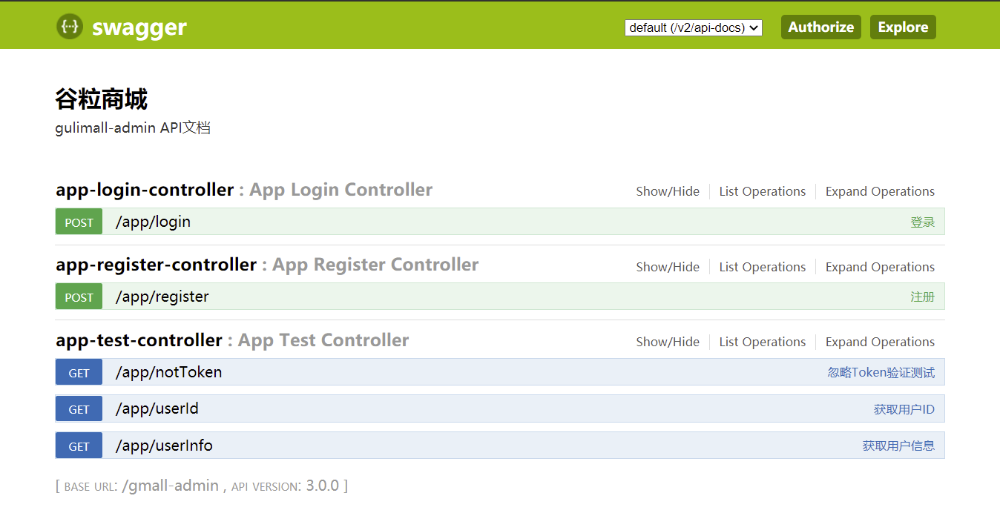
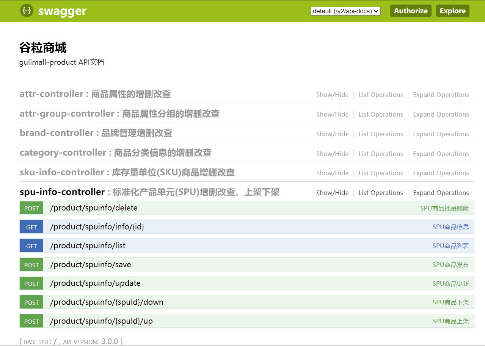
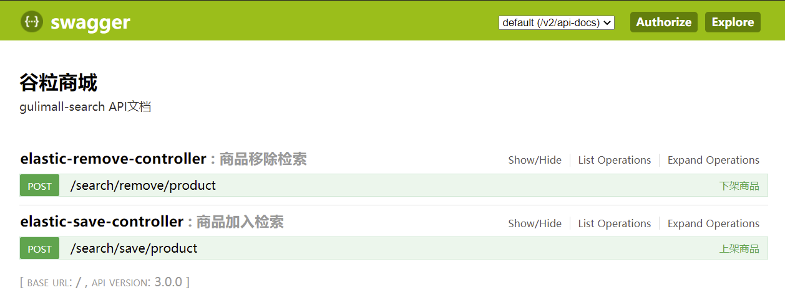

# 商城管理系统

## 前言

本项目主要致力于打造一个完整的电商系统，采用现阶段流行的技术栈，采用前后端分离的架构编写。

## 项目介绍

本项目是一套关于电商项目，包括前端后台管理系统、后端微服务集群。前端后台管理系统基于vue、element-ui构建开发，后端微服务基于Spring Cloud+Spring Cloud Alibaba + MyBatis - Plus实现商品的基本管理。后台管理系统主要提供功能包括：商品管理的增删改查及统计，即实现管理页面（至少包括列表及详情二级页面）和统计展示页面；商品列表和商品详情查询、商品编辑(比如上架、下架、改价)、暴露微服务接口，并支持服务熔断、降级、限流等。

## 项目演示

### 后台登录页面



### 主页面



### 微服务接口

#### 后台交互服务



#### 商品服务



#### 检索服务



## 组织架构

```java
gulimall
├── gulimall-common -- 工具类及通用代码
├── gmall-admin -- 后台登录交互服务
├── renren-generator -- 人人开源项目的代码生成器
├── gulimall-gateway -- 统一配置网关
├── gulimall-product -- 商品服务
├── gulimall-search -- 检索服务
├── gulimall-third-party -- 第三方服务
```

## 技术选型

### 后端技术

|         技术         |           说明           |                      官网                       |
| :------------------: | :----------------------: | :---------------------------------------------: |
|     Spring Boot      |       容器+MVC框架       |     https://spring.io/projects/spring-boot      |
|     Spring Cloud     |        微服务架构        |     https://spring.io/projects/spring-cloud     |
| Spring Cloud Alibaba |        一系列组件        | https://spring.io/projects/spring-cloud-alibaba |
|     MyBatis-Plus     |         ORM框架          |             https://mp.baomidou.com             |
|   renren-generator   | 人人开源项目的代码生成器 |   https://gitee.com/renrenio/renren-generator   |
|    Elasticsearch     |         搜索引擎         |    https://github.com/elastic/elasticsearch     |
|        Docker        |       应用容器引擎       |             https://www.docker.com              |
|         OSS          |        对象云存储        |  https://github.com/aliyun/aliyun-oss-java-sdk  |

### 前端技术

|  技术   |    说明    |           官网           |
| :-----: | :--------: | :----------------------: |
|   Vue   |  前端框架  |    https://vuejs.org     |
| Element | 前端UI框架 | https://element.eleme.io |
| node.js | 服务端的js |  https://nodejs.org/en   |

## 环境搭建

### 开发工具

|     工具      |       说明        |                      官网                       |
| :-----------: | :---------------: | :---------------------------------------------: |
|     IDEA      |   开发Java程序    |     https://www.jetbrains.com/idea/download     |
|  SwitchHosts  |   本地host管理    |       https://oldj.github.io/SwitchHosts        |
|    X-shell    | Linux远程连接工具 | http://www.netsarang.com/download/software.html |
|    Navicat    |  数据库连接工具   |       http://www.formysql.com/xiazai.html       |
| PowerDesigner |  数据库设计工具   |             http://powerdesigner.de             |
|    Postman    |  API接口调试工具  |             https://www.postman.com             |
|    Jmeter     |   性能压测工具    |            https://jmeter.apache.org            |
|    Typora     |  Markdown编辑器   |                https://typora.io                |

### 开发环境

|     工具      | 版本号 |                             下载                             |
| :-----------: | :----: | :----------------------------------------------------------: |
|      JDK      |  1.8   | https://www.oracle.com/java/technologies/javase/javase-jdk8-downloads.html |
|     Mysql     |  5.7   |                    https://www.mysql.com                     |
| Elasticsearch | 7.6.2  |               https://www.elastic.co/downloads               |
|    Kibana     | 7.6.2  |               https://www.elastic.co/cn/kibana               |
|     Nginx     | 1.1.6  |              http://nginx.org/en/download.html               |

注意：以上的除了JDK都是采用docker方式进行安装

K8s 持续集成持续部署

白名单